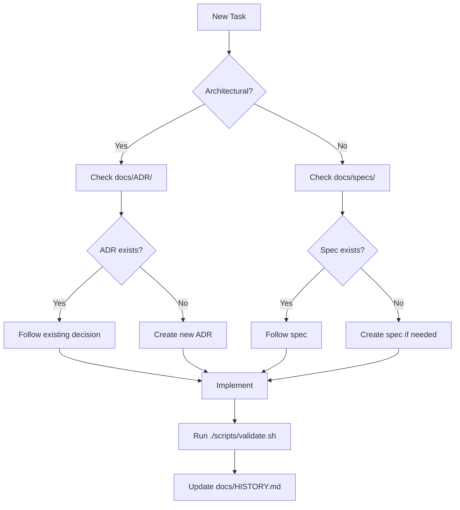

# Architecture Overview

## System Design

fix is a native Rust CLI that corrects shell commands using local LLM inference.

```
┌─────────────────────────────────────────────────────────────────┐
│                        User Shell                               │
│  $ gti status                                                   │
│  command not found: gti                                         │
│  $ fix                         # Shell function corrects + runs │
└─────────────────────────────────────────────────────────────────┘
                              │
                              ▼
┌─────────────────────────────────────────────────────────────────┐
│                      fix CLI                            │
├─────────────────────────────────────────────────────────────────┤
│  - Shell detection (SHELL env, platform detection)             │
│  - Prompt formatting (ChatML format)                           │
│  - Model path discovery (cwd, config dirs, custom path)        │
│  - GPU layer configuration                                      │
└─────────────────────────────────────────────────────────────────┘
                              │
                              ▼
┌─────────────────────────────────────────────────────────────────┐
│                    llama-cpp-2 Backend                          │
├─────────────────────────────────────────────────────────────────┤
│  - GGUF model loading                                          │
│  - Metal GPU acceleration (Apple Silicon)                      │
│  - Token-by-token generation                                   │
│  - Greedy sampling for deterministic output                    │
└─────────────────────────────────────────────────────────────────┘
                              │
                              ▼
┌─────────────────────────────────────────────────────────────────┐
│                      GGUF Model                                 │
├─────────────────────────────────────────────────────────────────┤
│  Base: Qwen2.5-0.5B-Instruct                                   │
│  Format: Q4_K_M quantization (~378MB)                          │
│  Training: ~150k synthetic shell command examples              │
└─────────────────────────────────────────────────────────────────┘
                              │
                              ▼
┌─────────────────────────────────────────────────────────────────┐
│                      Output                                     │
│  git status                                                     │
└─────────────────────────────────────────────────────────────────┘
```

## Directory Structure

```
fix/
├── fix-cli/                      # Rust native CLI
│   ├── src/main.rs               # CLI implementation
│   ├── tests/                    # Integration tests
│   │   ├── cli_test.rs           # Binary execution tests
│   │   ├── config_test.rs        # Cross-platform config tests
│   │   ├── wsl_test.rs           # WSL-specific tests
│   │   └── e2e_test.rs           # Model inference tests
│   ├── Cargo.toml                # Dependencies
│   └── Cargo.lock                # Locked versions
├── .github/workflows/            # CI/CD pipelines
│   ├── ci.yml                    # Core CI (build, test, E2E)
│   ├── release.yml               # Automated releases
│   ├── test-wsl.yml              # WSL testing
│   ├── test-windows-shells.yml   # PowerShell/CMD testing
│   ├── test-install.yml          # Installation script testing
│   └── test-distros.yml          # Linux distro testing
├── docs/                         # Documentation
│   ├── ARCHITECTURE.md           # This file
│   ├── testing-strategy.md       # Testing approach
│   └── ADR/                      # Architecture Decision Records
├── website/                      # GitHub Pages site
│   ├── install.sh                # Unix installer
│   └── install.ps1               # Windows installer
├── AGENTS.md                     # AI agent guidelines
├── README.md                     # User documentation
└── .gitignore
```

## Inference Flow

```
User Input          Prompt Formatting       Model Inference         Output
    │                     │                       │                    │
    ▼                     ▼                       ▼                    ▼
"gti status"  →   <|im_start|>system      →   Load GGUF        →  "git status"
    +               You are a shell           model with
  "bash"            command corrector...      Metal GPU
    +               <|im_end|>                    │
  (error)           <|im_start|>user              ▼
                    Shell: bash               Tokenize
                    Command: gti status       prompt
                    <|im_end|>                    │
                    <|im_start|>assistant         ▼
                                              Generate
                                              tokens
                                              (greedy)
                                                  │
                                                  ▼
                                              Stop at
                                              EOS/newline
```

## Key Design Decisions

### Why Rust + llama-cpp?
- Single binary distribution (no Python/Node runtime)
- Fast startup time (~100ms including model load)
- Metal GPU acceleration on Apple Silicon
- Cross-platform support via llama.cpp

### Why Local Inference?
- Privacy: commands never leave the machine
- Speed: no network latency
- Offline: works without internet
- Cost: no API fees

### Prompt Format (ChatML)
```
<|im_start|>system
You are a shell command corrector. Output only the corrected command./no_think
<|im_end|>
<|im_start|>user
Shell: bash
Command: gti status
Error: command not found: gti
<|im_end|>
<|im_start|>assistant
git status
```

## Supported Shells

| Shell | Detection | Platform |
|-------|-----------|----------|
| bash | SHELL env | Linux/macOS |
| zsh | SHELL env | macOS/Linux |
| fish | SHELL env | Cross-platform |
| powershell | PSModulePath env | Windows/Cross |
| cmd | COMSPEC env | Windows |
| tcsh | SHELL env | BSD/Linux |

## Model Discovery & Download

The CLI uses this flow to find or download models:

```
                    ┌─────────────────────────┐
                    │   --model flag set?     │
                    └───────────┬─────────────┘
                                │
                    ┌───────────▼─────────────┐
                    │  Yes: Use specified path │
                    │  No: Check config dir    │
                    └───────────┬─────────────┘
                                │
                    ┌───────────▼─────────────┐
                    │ Model exists locally?    │
                    └───────────┬─────────────┘
                         │             │
                        Yes           No
                         │             │
                         ▼             ▼
                    ┌─────────┐  ┌──────────────────┐
                    │  Load   │  │ Download from HF │
                    │  model  │  │ with progress bar│
                    └─────────┘  └──────────────────┘
```

### Config Directory (Cross-Platform)

| Platform | Path |
|----------|------|
| macOS | `~/Library/Application Support/fix/` |
| Linux | `~/.config/fix/` |
| Windows | `%APPDATA%\fix\` |

### Config File Structure

`config.json`:
```json
{
  "default_model": "qwen3-correct-0.6B"
}
```

### HuggingFace Integration

**Repository**: `animeshkundu/fix`

```
                    ┌─────────────────────────┐
                    │    --list-models        │
                    └───────────┬─────────────┘
                                │
                    ┌───────────▼─────────────┐
                    │ GET /api/models/{repo}/ │
                    │     tree/main           │
                    └───────────┬─────────────┘
                                │
                    ┌───────────▼─────────────┐
                    │ Filter for .gguf files  │
                    │ Display with sizes      │
                    └─────────────────────────┘


                    ┌─────────────────────────┐
                    │ --use-model <name>      │
                    └───────────┬─────────────┘
                                │
                    ┌───────────▼─────────────┐
                    │ Validate model exists   │
                    │ in HF repo              │
                    └───────────┬─────────────┘
                                │
                    ┌───────────▼─────────────┐
                    │ Download with progress  │
                    │ to config_dir()         │
                    └───────────┬─────────────┘
                                │
                    ┌───────────▼─────────────┐
                    │ Update config.json      │
                    │ default_model = <name>  │
                    └─────────────────────────┘
```

---

## Documentation Structure

```
docs/
├── README.md                    # Documentation index
├── ARCHITECTURE.md              # This file - system design
├── HANDOFF.md                   # Developer onboarding
├── HISTORY.md                   # Development timeline
├── testing-strategy.md          # Testing approach
├── ADR/                         # Architecture Decision Records
│   ├── 000-template.md          # ADR template
│   ├── 001-gguf-model-format.md
│   ├── 002-metal-gpu-acceleration.md
│   ├── 003-cross-platform-support.md
│   ├── 004-rust-cli-implementation.md
│   ├── 005-huggingface-model-distribution.md
│   └── 006-cross-platform-testing-strategy.md
├── agent-instructions/          # AI agent protocols
│   ├── 00-core-philosophy.md    # Docs = Code principle
│   ├── 01-research-and-web.md   # Research requirements
│   ├── 02-testing-and-validation.md
│   └── 03-tooling-and-pipelines.md
└── specs/                       # Technical specifications
    └── README.md                # Spec template
```

### Documentation Flow for AI Agents



### Documentation Purpose Matrix

| Document | When to Read | When to Update |
|----------|--------------|----------------|
| `AGENTS.md` | Starting any task | Adding new patterns |
| `CLAUDE.md` | AI agent context | Changing commands/style |
| `ADR/` | Architectural changes | New architectural decisions |
| `specs/` | Feature implementation | New features |
| `HISTORY.md` | Understanding past changes | After significant work |
| `HANDOFF.md` | Onboarding | Process changes |
